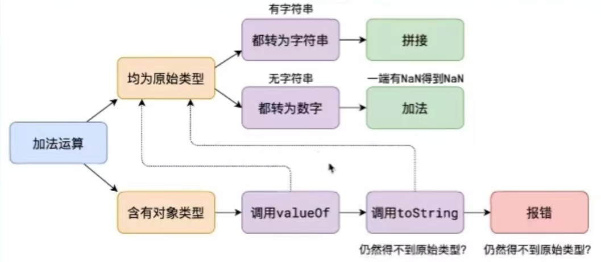
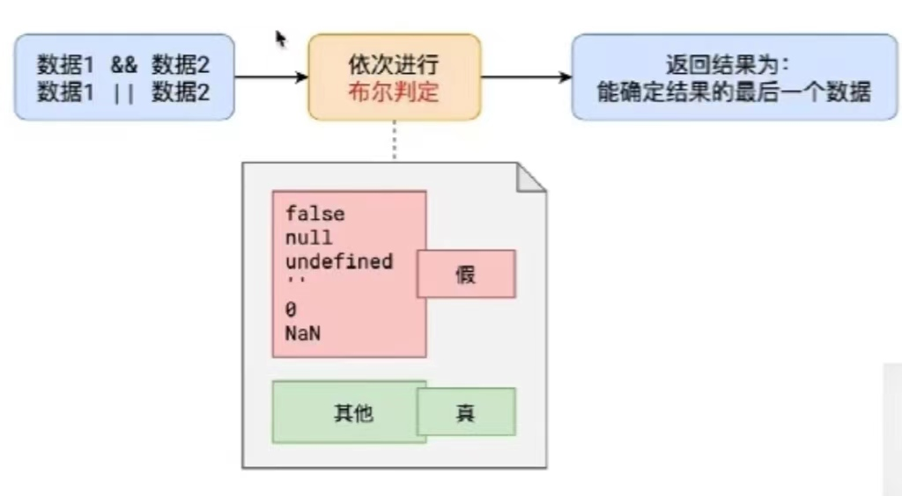
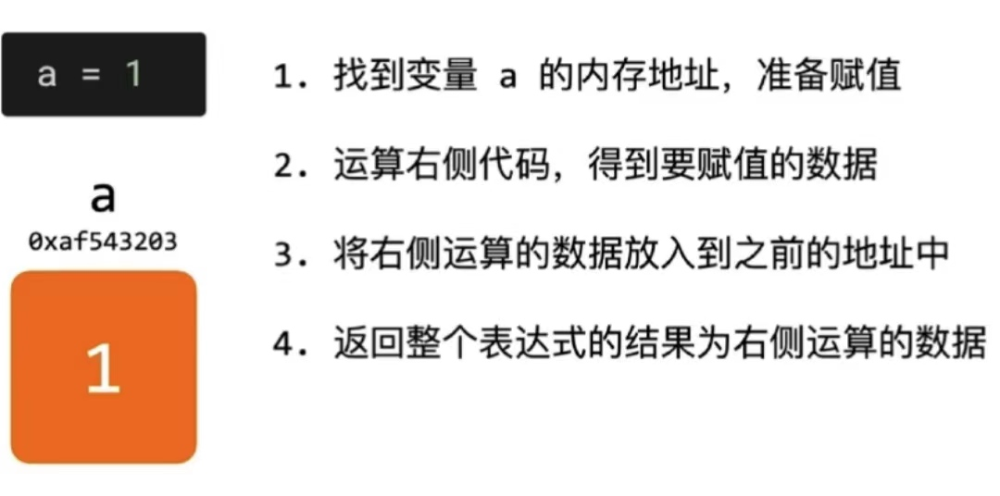

#  前端学习杂记

## 1. 数组求和，不能使用循环，不能使用数组自身提供的API，不能使用其他函数库
```javascript
// 思路：求和，必定要访问每一个元素，即需要遍历数组，遍历数组一般使用循环，但是需要注意，
// 循环和递归一般是可以相互转换的，循环可以转换为递归，递归也可以转换为循环，此处不能使用循环，可以使用递归求解
// 1. 假设有一个函数 f(index)，这个函数表示从数组nums的开始位置到 indx 位置的和，例如：f(0) 表示 [0, 0] 之间的和
// f(2) 表示 [0, 2]之间的和，f(3) 表示 [0, 3] 之间的和，那么可以看出，f(2) + nums[3] 就等于 [0, 3] 之间的和，
// 即 f(3) = nums[3] + f(2)，则可以推出 f(i) = nums[i] + f(i - 1)，当 i - 1 < 0 时，f(i - 1) = 0
// 那么，这个数组的和 sum 就为：f(nums.length - 1)代码如下：

let nums = [11,33,45,656,8898,1,15,66];

const f = (index) => {
  return index < 0 ? 0 : nums[index] + f(index - 1)
}

const getSUm = (nums) => {
  return f(nums.length - 1)
}

console.log(getSUm(nums));

```

## 2. 加法运算规则
```javascript
console.log('1' + 2);               // '12'
console.log('' + 2);                // '2'
console.log(false + 2);             // 2
console.log(true + 2);              // 3
console.log(undefined + 2);         // NaN
console.log(null + 2);              // 2
console.log([1, 2] + 2);            // '1,22'
console.log([1, 2, 3, 4] + 222);    // '1,2,3,4222'
console.log({n: 1, m: 2} + 1);      // [object Object]1
```


## 3. && 和 || 的运算流程
```javascript
// 注意：得到的是能确定结果的最后一个数据，是数据
console.log('3 && 5:', 3 && 5); // 3 && 5: 5
console.log('3 && 5 || 4 && 6:', 3 && 5 || 4 && 6); // 3 && 5 || 4 && 6: 5
console.log('3 && 5 && 4 && 6:', 3 && 5 && 4 && 6); // 3 && 5 && 4 && 6: 6
console.log('3 || 5:', 3 || 5); // 3 || 5: 3
console.log('4 || 5 && 6 || 7:', 4 || 5 && 6 || 7); // 4 || 5 && 6 || 7: 4
console.log('(4 || 5) && (6 || 7):', (4 || 5) && (6 || 7)); // (4 || 5) && (6 || 7): 6
```


## 4. js 赋值运算的详细流程
```javascript
// 以下代码输出什么？
let a = {n: 1};
let b = a;
a.x = a = {n: 2}

console.log(a.x) // undefined
console.log(b.x) // { n: 2 }

/**
 * 分析过程：
 * 1. let a = {n: 1}; => 创建一个对象 obj = {n: 1}，并将 a 赋值为对象 obj 的内存地址
 * 2. let b = a; => 将变量 b 的值赋值为的对象 obj 的内存地址，这时 a 和 b 同时指向 obj
 * 3. a.x = a = {n: 2}
 *    1）a.x = (a = {n: 2})：这时找到 a.x 的内存地址，因为 a 指向对象 obj ，obj 中没有 x 属性，
 *      所以会在 obj 中开辟一块内存空间，即向 obj 中添加一个 key 为 x 属性，属性的值为 (a = {n: 2}) 运算后结果
 *    2）a = {n: 2}：又是一个赋值运算，那么就再次走一遍赋值的运算流程，创建一个对象 obj2 = { n: 2}, 将 a 赋值为 obj2 的内存地址
 *      这时 a 就指向了 obj2，这一步运算完了，得到的运算结果就是 obj2 对象的内存地址，即 (a = {n: 2}) 的运算结果就为 obj2 的运算结果
 *    3）对 a.x 进行赋值，因为 a.x 的内存空间在 1）中已经开辟出来，就为 obj.x，就等待赋值了，现在将 (a = {n: 2}) 的运算结果，
 *      即 obj2 赋值给 a.x，即将 obj2 赋值给 obj.x，这时 obj = { n: 1, x: {n: 2}}，因为 a 已经指向了 obj2，这时只有 b 指向 obj，
 *      所以：a.x = obj2.x = undefined， b.x = obj.x = {n: 2}
 */

```

